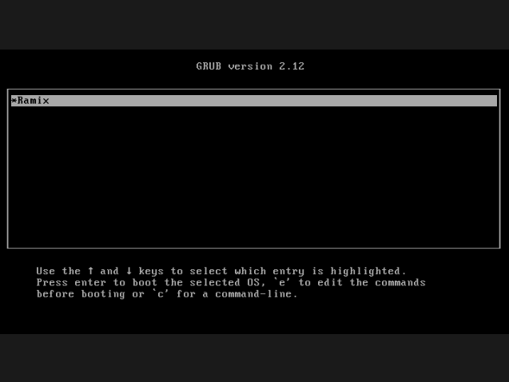
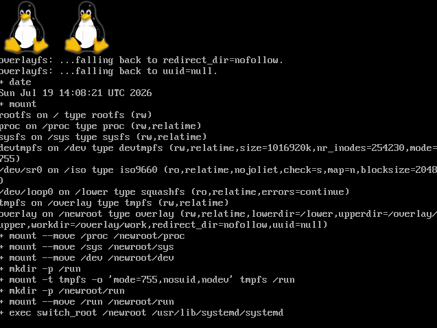
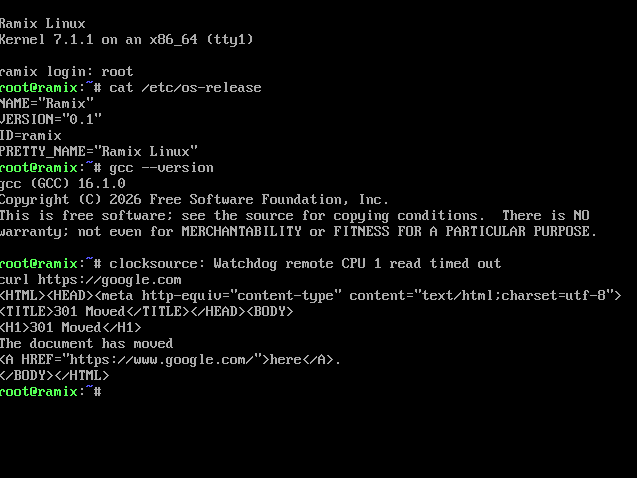
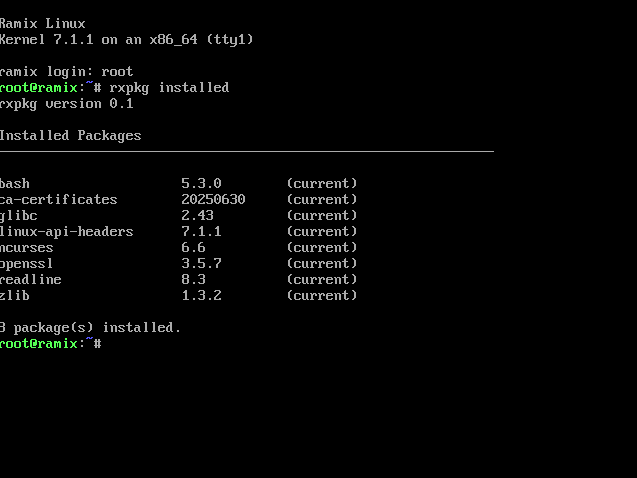
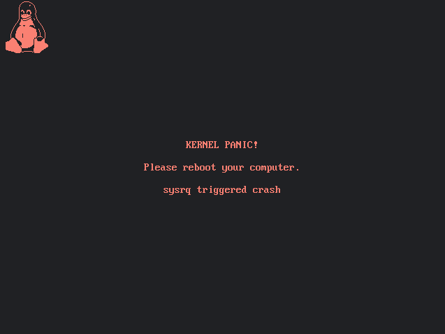

# Ramix

> A Linux distribution built completely from scratch by following the **Linux From Scratch (LFS)** project.

<table>
  <tr>
    <td></td>
    <td></td>
    <td></td>
  </tr>
  <tr>
    <td colspan="2"></td>
    <td></td>
  </tr>
</table>

## About

Ramix is a custom Linux distribution built from the ground up using the **Linux From Scratch (LFS)** methodology. Instead of modifying an existing distribution, every component—from the toolchain and C library to the kernel and userland—is compiled and assembled manually, providing complete control over the operating system.

The project aims to create a clean, lightweight, and fully customizable Linux environment while serving as a learning platform for understanding the internals of modern operating systems.

## Build System

Ramix includes its own automated build system that simplifies the LFS build process while keeping the resulting system reproducible.

Features include:

- GNU Toolchain
- Networking
- Custom Package Manager
- GPU Support (VirGL)

## Components

- Linux Kernel
- GNU C Library (glibc)
- GCC Toolchain
- GNU Core Utilities
- Bash
- Binutils
- Ncurses
- Util-linux
- Meson
- Ninja
- Cmake
- LLVM, Clang++
- System libraries and development tools

## Project Goals

- Make it Productionally Usage
- Boot on a Real Hardware
- Pipewire and Audio Support
- GUI Envionment

## Status

> Ramix is currently under active development. New packages, build improvements, and system components are added continuously.

## License

This project is licensed under the No License unless otherwise specified.